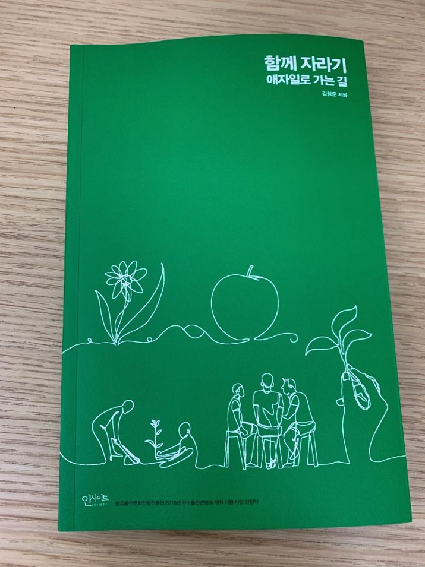

김창준님의 책이 나왔다고 해서 2시간 정도 걸려서 독파했다. [김창준님의 블로그](http://agile.egloos.com/)를 꾸준히 읽었다면 많이 접했던 내용일거라 생각된다. 부제가 ‘애자일로 가는 길’이지만 애자일과 관련된 내용보다는 **개발자의 성장과 개발자 주변의 것들에 대한 내용**이 주를 이룬다. 그리고 그 이유를 김창준님은 다음과 같이 말한다.

> 애자일의 핵심은 ‘함께 자라기’이다.

그래서 이 책은 **‘자라기’**, **‘함께’**, **‘애자일’** 순으로 진행된다. 공감되는 부분도 많고 생각해볼 거리도 많아서 재미있게 읽었다. 성장을 고민하고 있는 개발자라면 일독을 권한다.

몇 가지 키워드를 바탕으로 짧게 서평을 작성해봤다.

## 성장

올해는 이직을 고민했던 시기이며 그와 동시에 성장에 대해 많은 고민을 한 시기이기도 하다. 이 고민은 다른 글에서 구구절절 써 내려갈 예정이다.

> 학습에서는 피드백이 중요하다. (…) 지속적으로 자신의 감정 상태를 살피면서 지금 지루한지 불안한지 알아채야 한다.

책 전반에서 **‘피드백’**이란 단어가 많이 나온다. 그만큼 자신이 제대로 하고 있는지 피드백을 받는 것이 중요하다고 한다. 이 피드백은 다른 사람에게 받는 피드백이거나 내가 나 자신에게 주는 피드백이라고 이해했다. 지금 자신이 어느 상태인지 피드백을 통해 파악하는 것이다. 또한 이 피드백에는 적절한 시기가 있다고 한다. 빠른 시일 내에 피드백을 받고 반영해야 한다는 것이다.

책에 인상깊은 도식이 소개되었는데, 자신이 하고 있는 일의 **난이도**와 자신의 **실력**의 **상관 관계**에 따라 취할 수 있는 **액션**을 설명했다. 난이도가 높은데 실력은 없을 경우 **불안한** 상태가 되고 반대로 난이도는 낮은데 실력이 있을 경우 **지루한** 상태가 된다. 각각에 대한 액션은 내 상태를 파악한 후 시도해볼만하다.

> ‘잘하기’에 초첨이 맞춰진 ‘실행 프레임’

> ‘자라기’에 초점이 맞춰진 ‘학습 프레임’

회사에서 일을 할 때 어떤 **프레임**으로 업무를 바라보고 있는가 생각해보게 되었다. 이 프로젝트를 잘 마쳐서 사업적인 성과를 내는 것에 초점을 맞추었나, 팀의 성장, 개인의 성장, 기술적인 성과에 초점을 맞추었나. 훌륭한 사업적인 성과로 인센티브를 받는 것도 중요하고 주어진 업무를 학습의 일환으로 보고 성장하며 업무를 해결하는 것도 중요하다고 생각한다.

## 코칭

> 공감하면서 들어주려고 했고 상대가 어떤 멘탈 모델을 갖고 있는지 파악하려고 했다.

**‘멘탈 모델’**을 파악한다는 표현에서 뒤통수를 맞은 것 같았다. 막연하게 상대방의 눈높이에서 설명을 해야 한다고만 생각하고 있었는데 정확히 짚은 것 같다. 대화 형식으로 예를 들었고 그 내용은 다음과 같다. (질문자에게 질문)

- 어떤 식으로 ‘A’를 이해하고 있는가?
- 모르는 문제를 만났을 때 어떻게 해결하려고 시도하는가?
- 현재 자신의 답이 맞는지는 어떻게 확인하고 있는가?
- 다음 액션 아이템은 무엇인가?
- 액션 아이템이 너무 크거나 무겁지는 않은가?
- 다음 액션을 실행하는데 있어서 방해되는 요소가 있는가?
- 그 방해되는 요소를 함께 해결해 나갈 수 있는가?

질문자가 현재 **왜 이런 접근을 할 수 밖에 없었는지** 알 수 있기 때문에 좀 더 정확하고 효과적인 제안을 해줄 수 있다고 한다. 질문에 바로 답을 해주기 보다는 질문을 하여 상대방에 대해 좀 더 이해한 후 실질적인 대답을 해줄 수 있는 것이다. 다음부터는 나에게 오는 질문에 이러한 접근 방법으로 답하리라 다짐한다.

## 채용

> 작업 샘플 테스트와 구조화된 인터뷰로 채용을 진행했을 경우, 업무 성과와의 상관도가 높게 나왔다.

> 최소화된 경험치만 넘어가면 경력 연수와 실제 직무 성과와 상관성이 생각보다 낮다.

개인적으로는 채용 절차에서 서류 평가 후 면접 전의 단계가 필요하다면, 알고리즘 기반의 코딩 테스트보다 과제 형식을 더 선호한다. 여기서 과제는 팀에 와서 하게 될 업무와 관련된 과제이며 이 과제를 사전에 해결하여 제출하게 하는 것이다. 책에서는 이를 ‘작업 샘플 테스트’ 라고 했다.

인터뷰에서는 단순 기술 질문 외에도 구조화된 행동중심적 인터뷰를 강조했다. 여기서 **행동중심적 인터뷰**란 ‘개발자로서 협력에 대한 철학이 무엇인가’와 같은 추상적인 질문이 아니다. ‘지난 프로젝트에서 동료가 어려움을 겪을 때 어떤 행동을 하셨는지 구체적으로 예를 들어주세요’가 행동중심적 질문이다.

## 문장들

- 실수는 예방하는 것이 아니라 관리하는 것이다.
- 코칭, 멘토링 능력이 없는 팀장일수록 비난만 한다.
- 뭔가 잘하고 싶다면 이미 잘하는 사람을 관찰하고 인터뷰하는 것부터 시작하는 것이 큰 도움이 된다.
- 어떤 기술적 실천법이라도 그걸 현실에서 적용하기 위해서는 사회적 자본과 기술이 필요하다.
- 튜토리얼을 읽을 때 뭘 만들지 생각하고 읽는다.
- 표준 라이브러리 소스코드를 읽는다.
- 비전문가일수록 애초에 자신이 세운 계획에 집착한다.
- 뛰어난 소프트웨어 개발자일수록 타인과 인터랙션에 더 많은 시간을 쓰며 초보 개발자들에게 조언을 할 때 사회적인 측면, 예컨대 모르면 주변에 물어봐라. 남을 도와주라 등이 포함된다. 기술적인 조언만 하는 게 아니다.

---

책을 읽으면서 나를 돌아보게 되었다.(갑분회) 회고 전에 읽으면 참 괜찮은 책이다. 책의 내용을 정리한 것이 아니고 적히는대로 작성한 서평이라서 자세한 내용을 원한다면 책을 읽어보면 좋을 것 같다.
