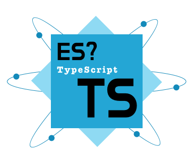

# [TS] TypeScript Playground 만들기

최소한의 npm 과 설정으로 TypeScript playground 만들기를 진행해보겠습니다. 사실 가장 빠른 playground 세팅은 [이 저장소](https://github.com/JaeYeopHan/typescript_playground)를 clone 하면 됩니다!ㅎㅎ

우선적으로 `TypeScript`님부터 모셔오도록 합시다 :)

```bash
$ npm install -g typescript
```

### 프로젝트 세팅

디렉토리를 하나 만들고 `npm init`을 통해 `package.json` 설정을 해줍니다.

```bash
$ mkdir typescript_playground && cd typescript_playground
$ npm init
# set configuration of npm
```

transpiler 를 태울 webpack 이 필요한데 그 config 파일과 TypeScript 설정파일인 `tsconfig.json`파일을 생성해줍니다. 그리고 타입스크립트 문법을 익히기 위해 tslint 를 사용할건데 tslint 설정 파일인 `tslint.json`파일도 생성합니다.

```bash
$ touch webpack.config.js tsconfig.json
$ touch index.html
$ mkdir src
$ touch src/index.ts
```

다음은 개인 취향에 따른 optional 한 세팅 파일들입니다.

```bash
# And create optional files...
$ touch .editorconfig
$ touch .gitignore
$ touch README.md
```

이 파일들의 내용은 repo 를 참고하세요!

이젠 필요한 npm 모듈들을 설치합니다.

```bash
$ npm install webpack webpack-dev-server --save-dev
$ npm install awesome-typescript-loader --save-dev
```

프론트엔드 개발자의 영원한 친구 `webpack`과 그 친구 `webpack-dev-server`를 설치해줍니다. 그리고 공식 문서에는 `ts-loader`를 사용하던데요, 저희는 가볍게 무시하고 `awesome-typescript-loader`를 설치해줍니다. 딱 이만큼만 설치하면 됩니다. ES6 를 한 번 사용해보려고 `babel`이며 `babel-core`며 `.babelrc`파일이며 온갖 이상한 npm 파일과 설정 파일을 생성한 기억이 한 번쯤은 있으실텐데요, 타입스크립트는 여기까지가 끝입니다. (행복합니다.)

### 설정 파일 작성하기

이제 각종 config 파일들을 작성해봅시다. 물론 설정 파일 또한 최소한으로 작성합니다.

#### webpack.config.js

```js
// webpack.config.js
const webpack = require('webpack')
const path = require('path')
const { CheckerPlugin } = require('awesome-typescript-loader')

module.exports = {
  entry: './src/index.ts',

  output: {
    filename: './dist/bundle.js',
  },

  resolve: {
    extensions: ['.ts', '.js'],
  },

  devtool: 'inline-source-map',

  module: {
    loaders: [
      {
        test: /\.ts?$/,
        loader: 'awesome-typescript-loader',
        include: path.resolve(__dirname, 'src'),
      },
    ],
  },

  plugins: [new CheckerPlugin(), new webpack.HotModuleReplacementPlugin()],
}
```

이 문서에서는 webpack tutorial 을 다루지 않습니다. webpack tutorial 은 [여기](https://github.com/JaeYeopHan/webpack2_tutorial)에서 따라하실 수 있습니다. (깨알홍보!) `HotMoudleReplacementPlugin` 이 녀석은 도저히 포기할 수 없어서 추가했습니다. 이제 본격적으로 typescript 설정 들어갑니다.

</br>

#### tsconfig.json

```json
{
  "compilerOptions": {
    "noImplicitAny": true,
    "removeComments": true,
    "target": "es5"
  },
  "awesomeTypescriptLoaderOptions": {
    /* ... */
  }
}
```

ES6 를 처음 시작하던 때의 `.babelrc`파일이 기억나시나요? 그것과 비슷하다고 볼 수 있는데요, 상당히 간단합니다. 거의 모든 부분을 `awesome-typescript-loader`에서 cover 하고 있고 입맛에 맞게 customize 할 수 있도록 `"awesomeTypescriptLoaderOptions"`라는 이름으로 인터페이스가 열려있습니다. `"target: "es5"`옵션을 추가해서 `getter`, `setter`문법을 지원받을 수 있도록 합니다.

</br>

#### index.html

javascript 로 transpile 될 typescript 파일을 브라우저 개발자 도구에서 확인하기 위해서 `index.html` 파일을 간단히 작성해줍니다.

```html
<!DOCTYPE html>
<html lang="en">
  <head>
    <meta charset="UTF-8" />
    <title>Document</title>
  </head>
  <body>
    Hello, TypeScript world!!
    <script src="/dist/bundle.js"></script>
  </body>
</html>
```

왠만한 설정은 모두 끝났습니다. webpack 에 설정한 loader 를 잘 타는지 확인하기 위해 index.ts 에 console 한 번 찍어봅니다.

```ts
console.log(`hello typescript world`)
```

그리고 start!

```bash
$ npm start
```

브라우저가 자동으로 실행될텐데요, 개발자 도구를 열어보면 hello typescript world 라는 console 이 찍혀있을 겁니다. 이제 TypeScript 로 해볼 수 있는 것을 이것 저것 해보면 됩니다.

해당 포스팅은 소스코드와 함께 다음 [GitHub Repository](https://github.com/JaeYeopHan/typescript_playground)에서 확인하실 수 있습니다.

감사합니다.

#### Reference

- [GitHub of awesome-typescript-loader](https://github.com/s-panferov/awesome-typescript-loader)
- [GitHub of tslint-loader](https://github.com/wbuchwalter/tslint-loader)
- [Jbee's Webpack tutorial](https://github.com/JaeYeopHan/webpack2_tutorial)
- [TypeScript Official Document](https://www.typescriptlang.org/docs/handbook/basic-types.html)
